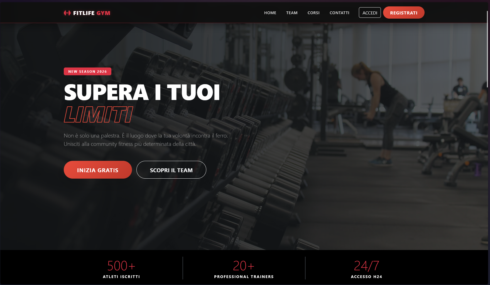
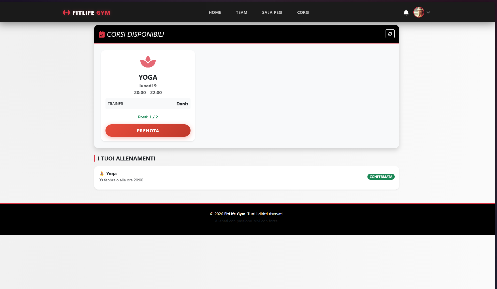
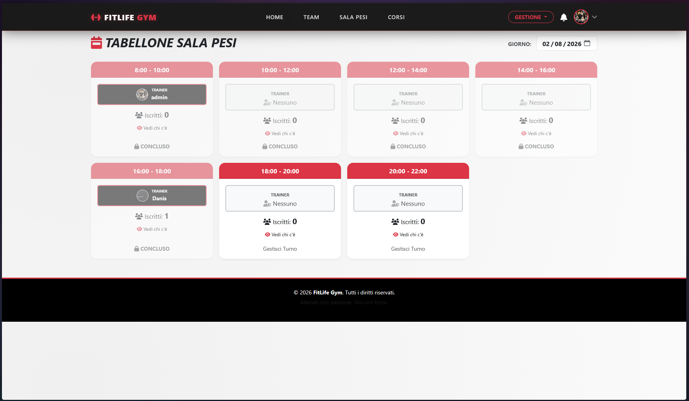

# 🏋️‍♂️ FitLife Gym - Gestionale Palestra Avanzato


**FitLife Gym** è una piattaforma web completa per la gestione di palestre, corsi fitness e prenotazioni in tempo reale. Sviluppata con **Java Spring Boot** e un frontend moderno, offre un'esperienza fluida per amministratori, trainer e atleti.

---

## ✨ Funzionalità Principali

### 🏢 Per la Palestra (Admin & Staff)
*   **Gestione Ruoli**: Sistema a 3 livelli (Admin, Trainer, User) con permessi differenziati.
*   **Dashboard Statistiche**: Grafici in tempo reale su affluenza, corsi più popolari e nuovi iscritti.
*   **Gestione Corsi**: Creazione e modifica lezioni (Yoga, Pilates, Boxe...) con orari e capienza massima.
*   **Tabellone Sala Pesi**: Gestione turni trainer e monitoraggio affluenza in fasce orarie da 2 ore.
*   **Albo Trainer**: Gestione profili staff con foto e bio personalizzabili.
*   **Centro Notifiche**: Invio notifiche automatiche agli utenti (conferma/rifiuto prenotazioni).

### 🏃‍♂️ Per gli Atleti (Utenti)
*   **Prenotazione Smart**: Iscrizione rapida a corsi e sala pesi.
*   **Area Personale**: Storico allenamenti con stato (In Attesa, Confermata, Rifiutata).
*   **Social**: Possibilità di vedere chi altro è iscritto a un turno ("Vedi chi c'è").
*   **Profilo**: Caricamento foto profilo personalizzata.

---

## 🛠️ Tecnologie Utilizzate

*   **Backend**: Java 21, Spring Boot 3, Spring Data JPA.
*   **Database**: MySQL (supporto H2 per dev).
*   **Frontend**: HTML5, CSS3 (Glassmorphism design), JavaScript (ES6+).
*   **Librerie**: Bootstrap 5 (UI), Chart.js (Grafici), FontAwesome (Icone).

---

## 🚀 Installazione e Avvio

### Prerequisiti
*   Java JDK 17+
*   MySQL (XAMPP o server dedicato)
*   Maven

### 1. Clona il Repository
```bash
git clone https://github.com/tuo-username/fitlife-gym.git
cd fitlife-gym
```

### 2. Configura il Database
Crea un database vuoto su MySQL chiamato `prenotazioni_db`.
L'applicazione è configurata per usare `root` senza password (default XAMPP). Se necessario, modifica `src/main/resources/application.properties`:

```properties
spring.datasource.url=jdbc:mysql://localhost:3306/prenotazioni_db?serverTimezone=UTC
spring.datasource.username=root
spring.datasource.password=TUA_PASSWORD
```

### 3. Avvia l'applicazione
```bash
./mvnw spring-boot:run
```

### 4. Goditi FitLife Gym
Apri il browser e vai su:
👉 **http://localhost:8080**

---

## 📸 Anteprima

### Landing Page & Login


### Dashboard Admin


### Tabellone Sala Pesi


---

## 👨‍💻 Autore


Sviluppato con passione da **DanisDevv**.

Se ti piace questo progetto, lascia una ⭐ su GitHub!
